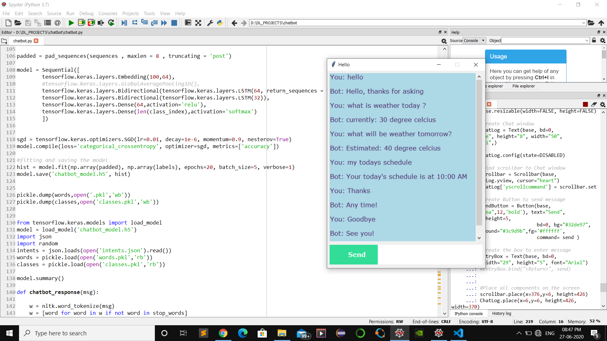

# Chatbot-develoment-using-NLP-and-Deep-learning
#### Chatbot model is composed of Embedding layer, Bidirection LSTM layers, and Dense layers. 
#### Message from the user is preprocessed by removing stop words and punctuation, stemming operation is performed to convert tokenized words to their root form, and finaly all the words are converted in to lower case.

#### Chatbot was trained on deep learning model to recognize the patterens from the user message

### Image of some responses generated by the chatbot:

